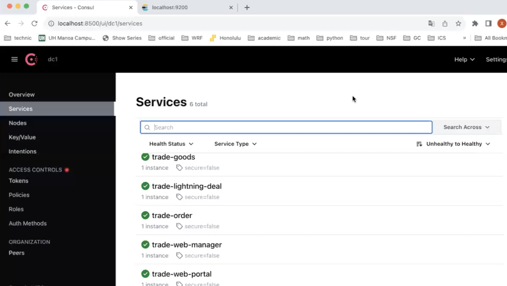
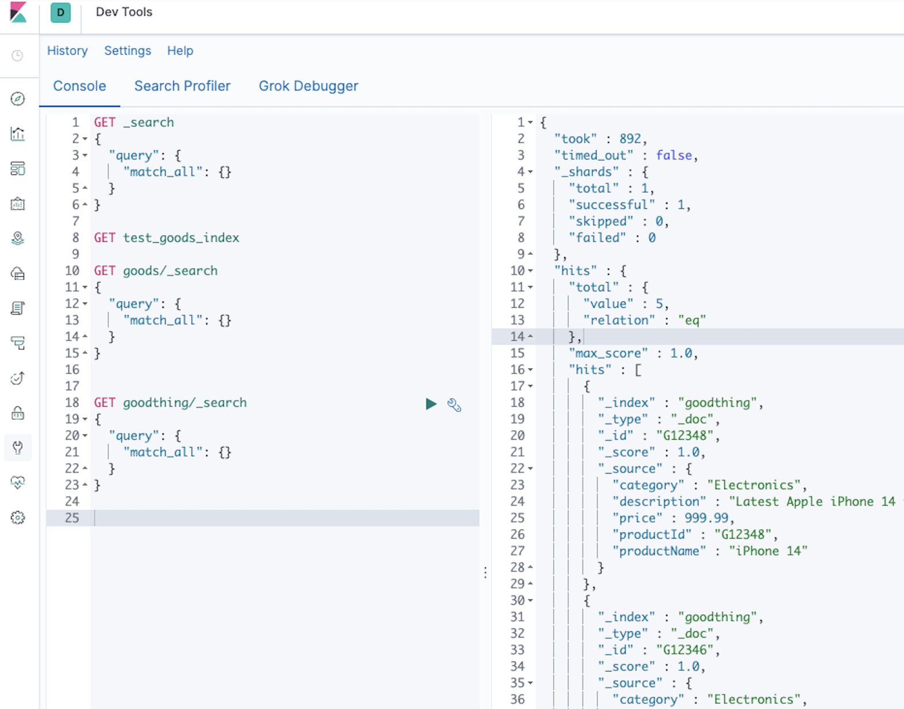
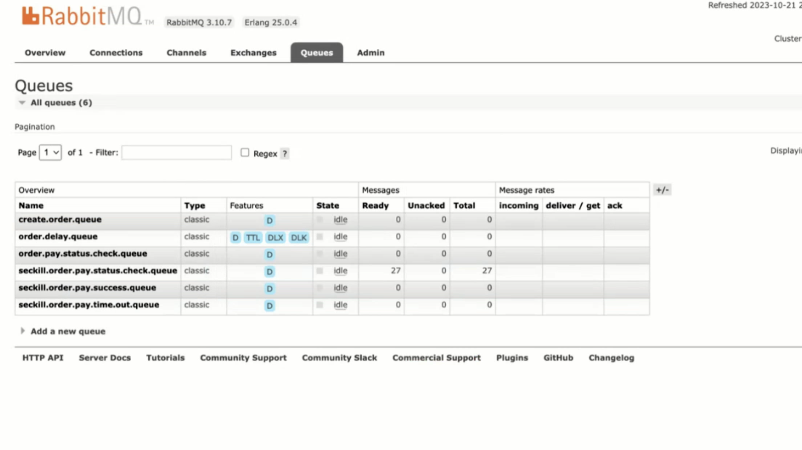
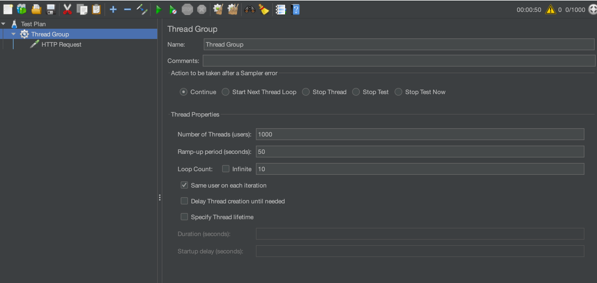

# Distributed High Concurrency Seckill Online Shopping System
Developed a web service for limited-time offers, designed to handle 100K QPS and ensure high performance during seckill events. The system addresses high concurrency, prevents overselling, and avoids redundant purchases.

### Key features

1. **distributed system**:

- Implemented a microservices architecture and distributed system for dynamic capacity expansion of seckill services during Black Friday using Spring Cloud as the framework, with Consul as the service registry and OpenFeign for RPC service calls.

2.  **Elasticsearch**
- Significantly improved search speed and functionality with Elasticsearch.
  
  

3.  **Prevented overselling**:
- Prevented overselling by managing transactions atomically with Redis and Lua.

4.  **Mitigated database traffic**
- Mitigated database traffic by using asynchronous messaging with RabbitMQ.
  

- Conducted load testing with JMeter.

5.  **Controlled malicious panic buying**
- Controlled malicious panic buying and purchase limits by caching user IDs with Redis.

7.  **static page optimization**
- Optimized page loading speeds through static page optimization with Thymeleaf.

8.  **AWS cloud services**
- Deployed the project to AWS cloud services for scalable and reliable hosting.
